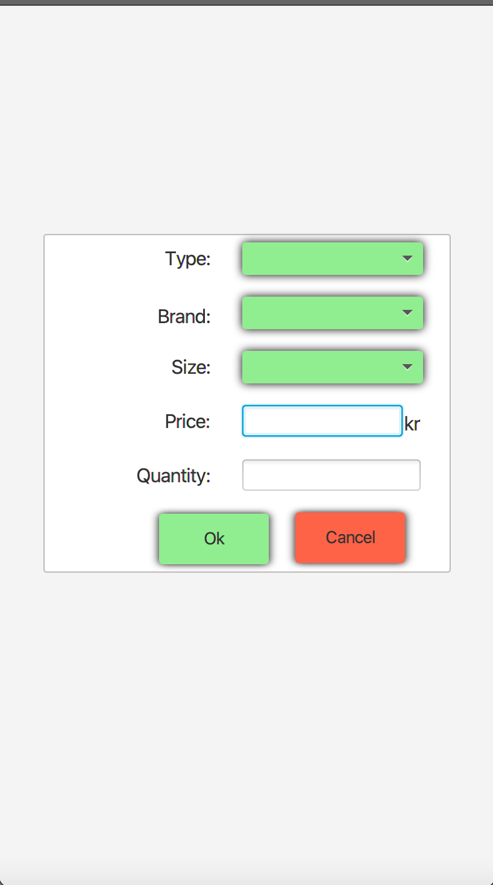
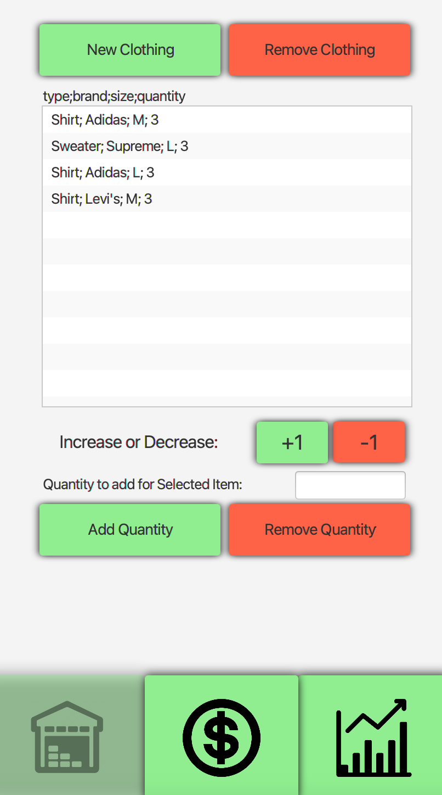
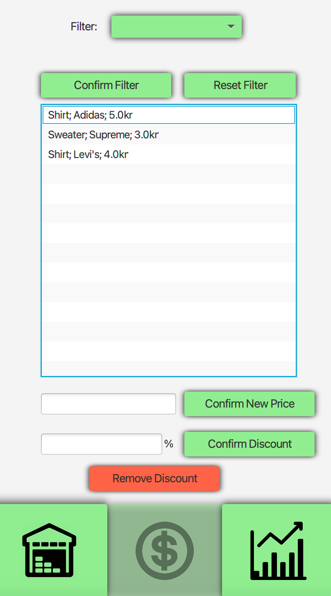
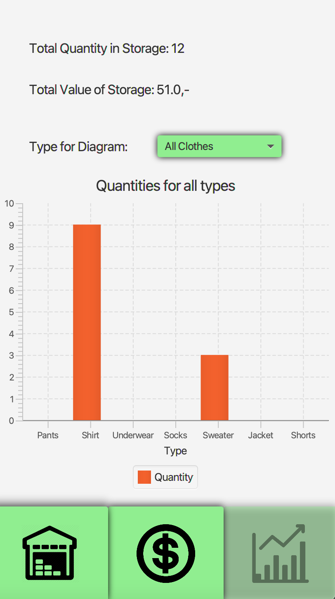
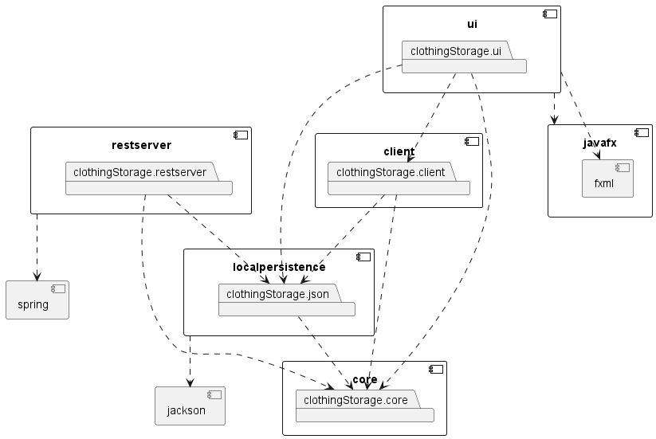

# ClothingStorage

Appen ClothingStorage har som hensikt å hjelpe klesbutikkeiere/-ansatte å holde kontroll på lagrene sine. Brukeren kan få en oversikt over klærne på lageret, legge til eller fjerne klær, endre priser, legge inn rabatter på klær og merker, samt mulighet for filtrering basert på klestype, merke, pris og rabatter. Appen har også en egen statistikk-side som viser statistikk over lageret.

## Endelig brukergrenssnitt

Disse bildene viser hvordan de ulike sidene av appen ser ut:

 

 

## Lager-side vs Pris-side

Lager-siden har oversikt over klær med type, merke, størrelse og antall av dette klesplagget på lager. Her får man ingen informasjon om pris, men kan øke og minke beholdningen av et klesplagg og legge til nye klesplagg.

Pris-siden har også en slags oversikt over klærne, men uten størrelser. Her kan man oppdatere pris og legge til rabatt, samt fjerne rabatten. Det er en kjent konvensjon at et klesplagg kan ha flere størrelser, men fortsatt samme pris. Dette brukes pris-siden til å vise. For eksempel dersom lager har 20 par Nike sokker i størrelse "S", og 10 par Nike sokker i størrelse "M", skal disse fortsatt vises med samme pris, altså kr 229,- på pris-siden. Nettopp dette er grunnen til at vi skiller mellom de to sidene og ikke har alt på én side.
På Pris-siden kan man også filtrere på flere ulike ting, blant annet klesmerke og pris. Oversikten blir dermed sortert, og man har fremdeles mulighet til å endre pris og rabatt mens den er det.
 
## Statistikk-siden

På statistikk-siden vises statistikken over lageret. På denne siden kan man se totalt antall klær og total verdi av alle klærne. I tillegg kan man se et søylediagram med oversikt over antall av av ulike typer klær, eller oversikt over antall av ulike størrelser for en spesiell type klær, avhengig av hva man har valgt i nedtrekksmenyen.

# Arkitektur

Appen baserer seg på en full 3-lags arkitektur bestående av domenelaget, brukergrensesnittlaget og persistenslaget. I domenelaget er kjernelogikken der man håndterer data og spesifiserer hva som kan gjøres med den. I brukergrensesnittlaget er ui-et som brukeren interagerer med. Persistenslaget håndterer persistens til fil der man definerer et filformat.

Et diagram for denne arkitekturen og avhengigheten mellom de ulike modulene er vist i et diagram under.

# Brukerhistorier

Under lenkes det til en rekke brukerhistorier som skal dekke funksjonalitet og krav til appen som ble beskrevet og vist over.

- ### Brukerhistorier fra release 1 er i **[release1/user-stories](/docs/release1/user-stories.md)**

- ### Brukerhistorier fra release 2 er i **[release2/user-stories](/docs/release2/user-stories.md)**

- ### Brukerhistorier fra release 3 er i **[release3/user-stories](/docs/release3/user-stories.md)**

