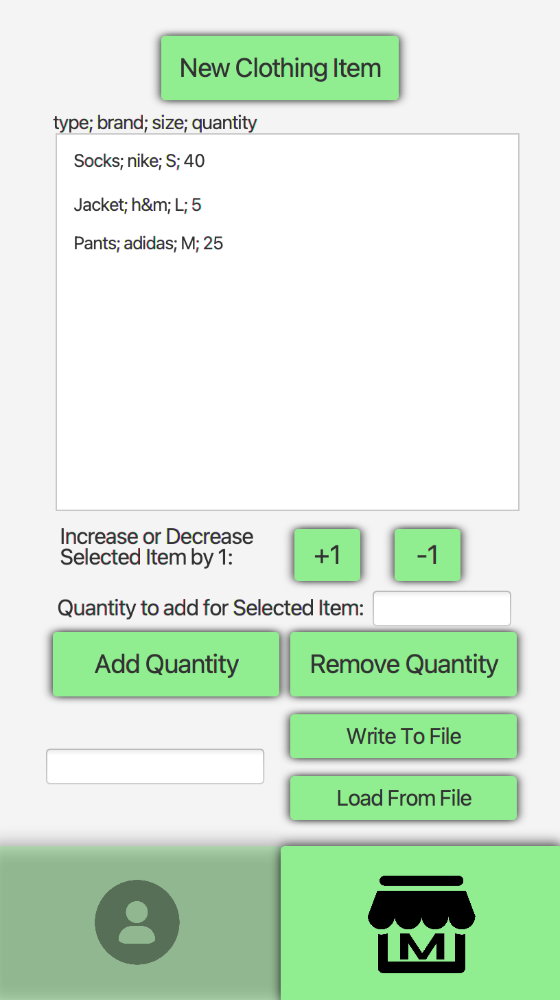

# ClothingStorage

Appen ClothingStorage har som hensikt å hjelpe klesbutikkeiere/-ansatte å holde kontroll på lagrene sine. Brukeren kan få en oversikt over klærne på lageret, legge til eller fjerne klær, endre priser, legge inn rabatter på klær og merker, samt mulighet for filtrering basert på klestype, merke, pris og rabatter.

## Illustrerende skjermbilder
Disse bildene viser hvordan vi tenker appen skal se ut når den er mer eller mindre ferdig.

 

### Lager-side vs Pris-side

Lager-siden har oversikt over klær med type, merke, størrelse og antall av dette klesplagget på lager. Her får man ingen informasjon om pris, men kan øke og minke beholdningen av et klesplagg og legge til nye klesplagg

Pris-siden har også en slags oversikt over klærne, men uten størrelser. Her kan man oppdatere pris og legge til rabatt.Det er en kjent konvensjon at et klesplagg kan ha flere størrelser, men fortsatt samme pris. Dette brukes pris-siden til å vise. For eksempel dersom lager har 20 par Nike sokker i størrelse "S", og 10 par Nike sokker i størrelse "M", skal disse fortsatt vises med samme pris, altså kr 229,- på pris-siden. Nettopp dette er grunnen til at vi skiller mellom de to sidene og ikke har alt på én side.

# Brukerhistorier

Under beskrives en rekke brukerhistorier som skal dekke funksjonalitet og krav til appen som ble beskrevet og vist over.

## Brukerhistorie 1: Oversikt over klær
Som ansatt i klesbutikk ønsker jeg å ha oversikt over klærne butikken har på lager, så jeg vet når jeg må bestille nye klær.

Bruker har behov for en oversikt over klærne som er på lager med mulighet for å legge til flere klær når det kommer nye leveranser. I tillegg må bruker ha oversikt over antall av hver klestype for å vite når hun må bestille mer.

Det er også ønskelig for ansatte å ha en separat liste med oversikt over prisene til ulike klesplagg. Disse vil variere avhengig av klesmerke.

### Viktig å se
- Oversikt(liste) over klærne på lager
- Oversikt(liste) over priser på klær avhengig av merker

### Viktig å kunne gjøre
- Legge til nye klær

## Brukerhistorie 2: Lese og skrive til filer
Som eier av klesbutikk ønsker jeg å kunne få filer med informasjon om klærne på lageret slik at jeg kan bruke filene når jeg må bestille flere klær eller til økonomiske rapporter.

Bruker har behov for å skrive til og lese fra filer for å kunne bruke disse videre til bestilling og rapporter.

### Viktig å se
- Knapp for å lese fra fil
- Knapp for å kunne skrive til fil

### Viktig å gjøre
- Lese fra fil
- Skrive til fil

## Brukerhistorier release2 (3, 4 og 5)

Brukerhistorier som ble lagt til i release 2 er i **[user-stories release2](/docs/release2/user-stories.md)**.

## Brukerhistorier release3

Brukerhistorier som ble lagt til i release 3 er i **[user-stories release3](/docs/release3/user-stories.md)**.

