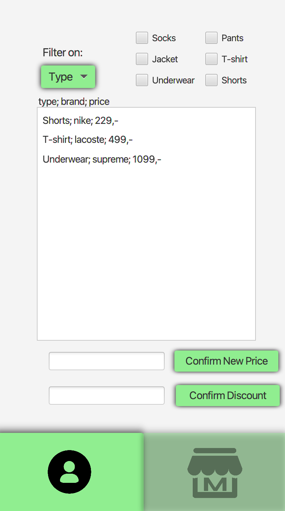

# Om ClothingStorage

Appen ClothingStorage har som hensikt å hjelpe klesbutikkeiere/-ansatte å holde kontroll på lagrene sine. Brukeren kan få en oversikt over klærne på lageret, legge til eller fjerne klær, endre priser, legge inn rabatter på klær og merker, samt mulighet for filtrering basert på klestype, merke, pris og rabatter.

## Illustrerende skjermbilder
Disse bildene viser hvordan vi tenker appen skal se ut når den er mer eller mindre ferdig.

 

# Brukerhistorie: Oversikt over klær
Som eier/ansatt av klesbutikk ønsker jeg å ha oversikt over klærne butikken har på lager, så jeg vet når jeg må bestille nye klær.

Bruker har behov for en oversikt over klærne som er på lager med mulighet for å legge til flere klær når det kommer nye leveranser. I tillegg må bruker ha oversikt over antall av hver klestype for å vite når hun må bestille mer.

Det er også ønskelig for ansatte å ha en separat liste med oversikt over prisene til ulike klesplagg. Disse vil variere avhengig av klesmerke.

### Viktig å se
- oversikt over klærne på lager
- oversikt over priser på klær avhengig av merker

### Viktig å kunne gjøre
- legge til nye klær

# Brukerhistorie: Lese og skrive til filer
Som eier av klesbutikk ønsker jeg å kunne få filer med informasjon om klærne på lageret slik at jeg kan bruke filene når jeg må bestille flere klær eller til økonomiske rapporter.

Bruker har behov for å skrive til og lese fra filer for å kunne bruke disse videre til bestilling og rapporter.

### Viktig å se
- knapp for å lese fra fil
- knapp for å kunne skrive til fil

### Viktig å gjøre
- lese fra fil
- skrive til fil